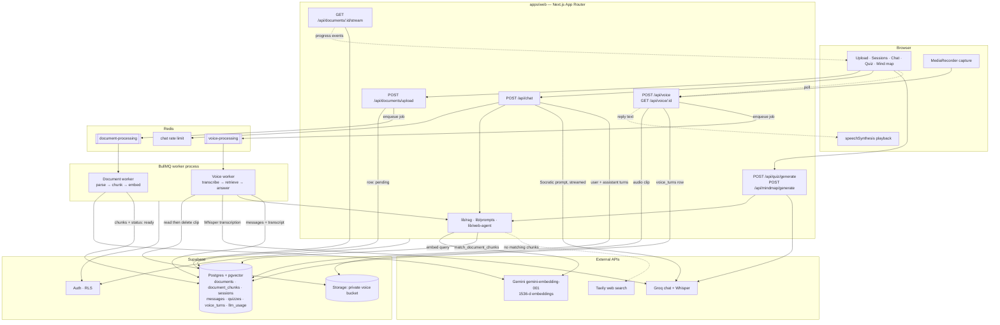

# socrati

socrati is a Socratic AI tutor built on the student's own course material.
Students upload their documents, build study sessions from the ones they choose,
and talk with a tutor that asks guiding questions instead of handing over the
answer.

The repo is a TypeScript monorepo. `apps/web` is a Next.js App Router
application and `packages/*` holds the shared UI and config packages. Supabase
provides authentication, Postgres with pgvector, and file storage. Redis backs
the job queues and rate limits, and a BullMQ worker runs document ingestion and
voice processing.

## Getting started

Install dependencies, create `.env` and `apps/web/.env.local` from the template
in [BUILD.md](./BUILD.md), then:

```bash
npx supabase db push   # apply the migrations
npm run dev            # Next.js on :3000 and the worker
```

## What it does

- Upload course documents and watch them move through parsing, chunking, and
  embedding until they are ready to study.
- Create study sessions from one or more ready documents.
- Chat with a tutor grounded in the retrieved chunks, with Tavily web search as
  a fallback when the uploaded material does not cover the question.
- Generate quiz questions and mind maps from the documents in a session.
- Record a spoken question in the browser and get a Socratic reply back as chat
  text, with optional playback in the browser.
- Persist sessions, messages, documents, quizzes, and document-processing state.

## Architecture

The web app owns every request and writes to Supabase; anything slow —
document ingestion and voice turns — goes onto a Redis queue and is picked
up by the worker process.



## How it works

Document ingestion starts with an upload, which writes a `documents` row with
status `pending` and enqueues a BullMQ job. The worker parses the file, splits it
into chunks, embeds them with Gemini (`gemini-embedding-001`, 1536 dimensions,
normalized), and saves them for retrieval. It then marks the document `ready`,
and the browser picks up the transition over an SSE progress stream.

A chat turn embeds the question and matches it against the session's chunks
through the `match_document_chunks` RPC. When retrieval comes back empty, the
request falls back to Tavily web search. Either way the context goes into the
Socratic system prompt, Groq streams the reply, and both turns are persisted.

Voice mode records in the browser with `MediaRecorder` and posts the clip to
`/api/voice`. The audio goes to a private Storage bucket alongside a
`voice_turns` row, and a `voice-processing` job transcribes it with Groq Whisper.
From there the transcript runs through the same retrieval and Socratic prompt as
a typed question: the worker stores it as a user message, stores the reply as an
assistant message, and deletes the audio. The client polls `GET /api/voice/:id`
and can speak the reply with `speechSynthesis`.

## Repository layout

```text
apps/
  web/      Main Socrati web application

packages/
  ui/                   Shared React UI primitives
  eslint-config/        Shared ESLint configuration
  typescript-config/    Shared TypeScript configuration

supabase/
  migrations/           Database schema and RPC migrations

tests/
  *.test.ts             Node test suite for core app behavior
```

`apps/web/app` holds the pages (upload, session creation, chat, quiz, mind maps,
progress, and auth) and the API route handlers. `apps/web/components` holds the
chat UI, sidebar, and mind map panel, and `apps/web/lib` holds the pipeline
itself: parsing, chunking, embedding, retrieval, prompts, queues, and the
workers. The schema, RLS policies, and `match_document_chunks` RPC live in
`supabase/migrations`, and `tests` covers the handlers and library modules.

## Tech stack

- TypeScript, React, and Next.js App Router on Turborepo
- Supabase for auth, Postgres with pgvector, and Storage, with Drizzle for the
  typed schema in `apps/web/lib/db/schema.ts`
- Redis and BullMQ for background jobs and rate limiting
- Groq for chat, quiz, mind map, and Whisper transcription
- Google Gemini for document embeddings
- Tavily for web search when the documents fall short

## Docs

Build, database, development, deploy, test, and eval workflows are in
[BUILD.md](./BUILD.md). Conventions and architecture notes for coding agents are
in [AGENTS.md](./AGENTS.md).
